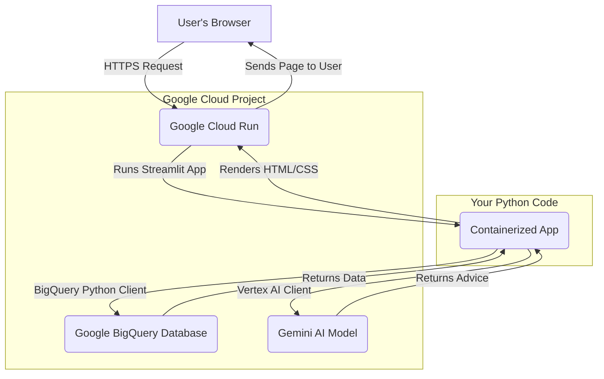

# Spaghetti Crew Workout App

A full-featured, cloud-native social fitness application built with Python. This app allows users to register, track their workouts, participate in weekly challenges, and engage with a community of friends. The entire backend is powered by Google Cloud, and the application is deployed as a containerized service on Google Cloud Run.


---

## Features

This application includes a complete set of features for a modern social fitness platform:

* **Secure User Authentication:** Full user registration and login system with hashed passwords.
* **Password Reset Functionality:** A complete, multi-step password reset flow using secure, expiring tokens.
* **Personalized Activity Dashboard:** A central hub for users to view their workout history, aggregated stats (total distance, steps, calories), and detailed sensor data from their activities.
* **Social Community Feed:** Users can view a live feed of posts from their friends, creating an engaging community experience.
* **Weekly Fitness Challenges:** A dynamic challenge system where users can join weekly competitions based on distance, steps, or total workouts. Leaderboards display current rankings and celebrate last week's winners.
* **AI-Powered Motivation:** Integrates with Google's Vertex AI (Gemini) to provide users with personalized motivational quotes based on their daily workout performance.

---

## Tech Stack & Architecture

This project is built on a modern, scalable, and serverless architecture, leveraging the power of Google Cloud Platform.

* **Frontend:** **Streamlit** - A pure Python framework used to build the entire interactive user interface.
* **Database:** **Google Cloud BigQuery** - A serverless data warehouse used as the primary database for storing all user data, workouts, posts, and challenge information.
* **Hosting:** **Google Cloud Run** - A fully managed serverless platform that runs the containerized Streamlit application. It automatically scales with traffic and scales down to zero, making it highly cost-effective.
* **Containerization:** **Docker** - The application is packaged into a container using a `Dockerfile`, ensuring consistency between local development and cloud deployment.
* **Authentication & Deployment:** **Google Cloud SDK (`gcloud`)** - Used for command-line interaction with Google Cloud, including deploying the application to Cloud Run.

#### **How It Works**



---

## Local Development Setup

Follow these steps to run the application on your local machine.

#### 1. Prerequisites

* Python 3.11
* [Google Cloud SDK](https://cloud.google.com/sdk/docs/install) installed and authenticated (`gcloud auth login`).
* A Google Cloud project with the **BigQuery API**, **Cloud Run API**, and **Cloud Build API** enabled.

#### 2. Clone the Repository

```bash
git clone [https://github.com/JuanAlvarado305/Streamlit-Workout-Activity-App.git](https://github.com/JuanAlvarado305/Streamlit-Workout-Activity-App.git)
cd Streamlit-Workout-Activity-App
```

#### 3. Set Up Virtual Environment

Create and activate a virtual environment to manage dependencies.

```bash
# Create the environment
python -m venv env

# Activate it (Windows)
.\env\Scripts\activate

# Activate it (macOS/Linux)
source env/bin/activate
```

#### 4. Install Dependencies

```bash
pip install -r requirements.txt
```

#### 5. Configure Local Credentials

* Create a service account in your Google Cloud project and grant it the **`BigQuery User`** and **`BigQuery Data Editor`** roles.
* Download the JSON key file for this service account.
* In the root of the project, create a file named `.env`.
* Add the following line to the `.env` file, replacing the path with the actual path to your downloaded key file:
    ```
    GOOGLE_APPLICATION_CREDENTIALS="C:/path/to/your/keyfile.json"
    ```
* **Important:** Ensure the `.env` file is listed in your `.gitignore` file to prevent committing your secret key.

#### 6. Run the App

```bash
streamlit run app.py
```

The application will open in your web browser at `http://localhost:8501`.

---

## Deployment to Google Cloud Run

This application is designed to be deployed as a container on Google Cloud Run.

1.  **Grant Permissions:** In the Google Cloud IAM console, grant the **`BigQuery User`** and **`BigQuery Data Editor`** roles to the **Compute Engine default service account** (`your-project-number-compute@developer.gserviceaccount.com`). This allows Cloud Run to securely access the database without needing a key file.
2.  **Deploy:** From your local terminal, run the following `gcloud` command from the project's root directory:
    ```bash
    gcloud run deploy streamlit-workout-app --source . --allow-unauthenticated
    ```
    * You will be prompted to select a region. Choose one close to you (e.g., `us-central1`).
    * The command will build the container using the `Dockerfile`, push it to Google's Artifact Registry, and deploy it to Cloud Run.
    * Upon completion, it will provide a public URL where your app is live.

---

## Project Structure

```
.
├── .streamlit/
│   └── config.toml      # App theme and configuration
├── custom_components/   # HTML templates for custom components
├── pages/
│   ├── Activity_Page.py # Code for the detailed activity view
│   └── hidden/          # Pages for auth flow (login, register, etc.)
├── .env                 # (Local Only) Stores path to GCP credentials
├── .gitignore           # Specifies files to ignore for Git
├── app.py               # Main application entry point
├── data_fetcher.py      # All functions for interacting with BigQuery
├── Dockerfile           # Instructions for building the app container
├── modules.py           # UI components and display logic
└── requirements.txt     # List of Python dependencies

